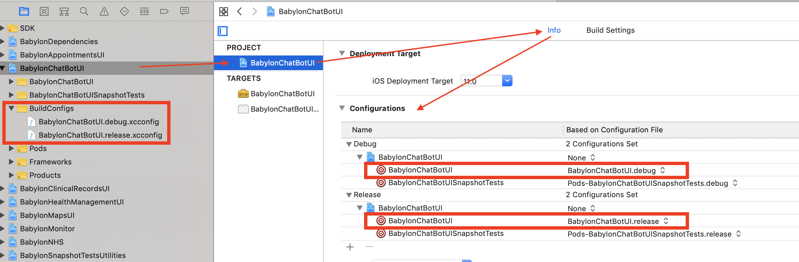
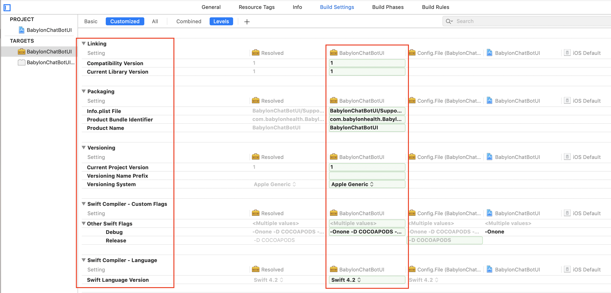

# Adding Frameworks to the project

Out project uses a modular architecture, with the app being split in separate projects in the workspace, each producing a framework for one of those modules.

This means that we share internal frameworks among different projects through the same workspace. But there are a few quirks of how Xcode currently manages it, and needs manual settings to work properly.

## Creating a new framework target

If you need to create a new framework target in our project to add a new module, you need to know that we use a `Framework.{debug|release}.xcconfig` configuration file to ensure all our internal frameworks use consistent settings. But since our internal frameworks also use CocoaPods to reference the third-party libraries they use, we need to merge our own `xcconfig` with the ones from CocoaPods.

_The following steps will guide you to configure a new module named `BabylonNewFramework`. Replace every occurrence of `BabylonNewFramework` in the following instructions with the actual name of your new internal framework._

Start by creating the new framework target (and its associated Test target(s)) in Xcode, then follow the steps below:

### Add Third-Party dependencies in the Podfile

1. Add the framework target (and its test target(s)) to the `Podfile`, listing all its third-party dependencies (like `Bento`, `ReactiveCocoa`, `ReactiveFeedback`, etc) in there
2. Run `bundle exec pod install` to install the framework's pods

### Add internal dependencies manually

If your framework itself depends on other internal Babylon frameworks (e.g. `BabylonCore`, `BabylonDependencies`, ...), those are not Pods and thus not added via the `Podfile` but are frameworks produced by other projects in our workspace, so you need to add them manually:

1. Add depending internal frameworks to the `"Linked Binary with Libraries"` Build Phase
   * You only need to do this step if your framework itself depends on other internal frameworks. Avoid any unnecessary dependencies (which also avoids limiting the parallelisation during build)
   * You need not add dependencies of your dependencies — only the ones that you refer to in code directly
   * You need only to do that for **internal** frameworks. Third-party frameworks are already linked via CocoaPods thanks to the `Pods-BabylonNewFramework` umbrella framework generated by CocoaPods
2. Be sure that the internal `.framework` file reference – that was added in the Project Navigator by Xcode during the previous step – was added under the `Frameworks` group (move it there if needed) **and is referenced as `Relative to Build Products`**


### Create the merging xcconfig

1. Create a `"BuildConfigs"` folder next to your `BabylonNewFramework.xcodeproj`, so typically in `<RepoRoot>/BabylonNewFramework/BuildConfigs`
2. Create two new `xcconfig` files in that folder with the following content:

   * `BabylonNewFramework.debug.xcconfig`:

	```
	#include "../BuildConfigs/Framework.Debug.xcconfig"
	#include "../Pods/Target Support Files/Pods-BabylonNewFramework/Pods-BabylonNewFramework.debug.xcconfig
	```

   * `BabylonNewFramework.release.xcconfig`:

	```
	#include "../BuildConfigs/Framework.Release.xcconfig"
	#include "../Pods/Target Support Files/Pods-BabylonNewFramework/Pods-BabylonNewFramework.release.xcconfig
	```

3. Add the `BuildConfigs` folder to your Xcode project (by drag & drop or right-click + "Add Files to ...").
   * Be extra sure NOT to include the `xcconfig` files in the target when adding the references (the `xcconfig` files should be referenced in the project but should not belong in any target so **uncheck all target checkboxes**)

4. Select the Project in the Project Navigator on the left, then the "Info" tab on the project, and affect the proper `xcconfig` files to your framework target
   * Make sure you pick the right file for Debug and Release configurations, namely `BabylonNewFramework.debug` for "Debug" and `BabylonNewFramework.release` for "Release"
   * Note that you should affect this merging `xcconfig` only to your framework target, not to the Test targets (those will directly use the `Pods-BabylonNewFramework-Tests` xcconfigs generated by CocoaPods)

   

### Delete unnecessary build settings

Generally, you only need to keep the ones below:

   

## Link Babylon Apps to the new framework

Once your new framework has been configured and builds properly with its own dependencies, don't forget to add it to the relevant application targets in the `babylon.xcodeproj` project if needed:

1. Add your `BabylonNewFramework.framework` to the `"Link Binary with Libraries"` build phase
2. Add the `BabylonNewFramework.framework` to the `"Embed Frameworks"` build phase so that it's copied in the app bundle
3. Be sure that the `BabylonNewFramework.framework` file reference – that was added in the Project Navigator by Xcode during the previous steps – was added under the `Frameworks` group (move it there if needed) **and is referenced as `Relative to Build Products`**

## One xcconfig pair and project per module

We tend to avoid having multiple frameworks acting as babylon modules in a single project, and prefer to keep one project per module.
If you really have multiple related frameworks in the same Xcode project (e.g. `BabylonMonitor` + `BabylonMonitorUI` frameworks targets are hosted in the same Xcode `BabylonMonitor` project) though, you'll repeat the steps for each framework you are adding.

Each framework has to have its own `Babylon{TheFrameworkName}.{debug|release}.xcconfig` files. You should not reuse a single `xcconfig` for multiple frameworks even in the same project.

## Adding new dependencies to an already existing module

Just follow the same instructions from ["Add Third-Party dependencies in the Podfile"](#add-third-party-dependencies-in-the-podfile) and ["Add internal dependencies manually"](add-internal-dependencies-manually) above.
