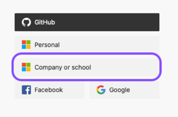
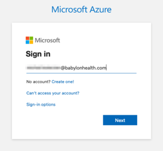
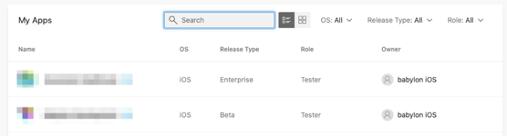
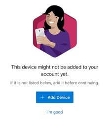
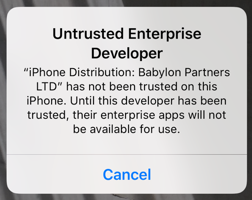
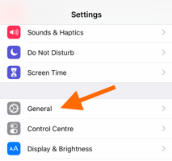
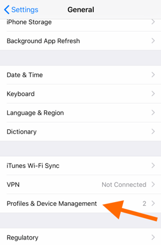
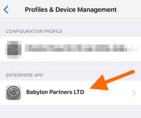
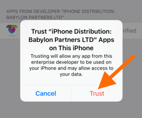

Follow steps below to get access to our nightly builds.

# Accessing App Center builds

### Steps to install
1. On your device, visit [App Center](http://appcenter.ms/apps)

2. As a login method, select `Company or school`

	

3. Type in your babylon email and click `Next`

	

4. You'll be redirected to the okta login page, type your username and password and click `Sign in`

	

5. On the project list, select the project you want to install. If you don't see the project you're looking for, ask on #ios channel for invitation.

	

6. If you'll be promted that your device is not added to our account yet, click `I'm good`

	

7. On the builds list, select the one you want to install and click `Install`. iOS would ask you to confirm again if you intend to perform the installation. Tap on `Install` again.

	

8. The build should now appear on your Home screen.

### Untrusted Enterprise developer alert
When the downloading has finished, your first attempt to launch the app might be interrupted by the following alert

If this happened, follow these steps:

1. Open your iPhone Settings. Select `General`

	

2. Select `Profiles & Device Management`

	

3. Select `Babylon Partners LTD`

	

4. Select `Trust Babylon Partners LTD`

	

5. Select `Trust`

	

6. You should be able to launch the build now.

# Adding people to the organisation
App Center supports Azure Active Directory so there should be no reason to invite people - everyone with Babylon okta account should be able to access our projects and builds. However, for some reasons, it sometimes doesn't work and we need to invite people manually. In such case, follow steps below.

### Steps to invite

1. Visit [App Center login page](https://appcenter.ms/sign-in) (using incognito mode to avoid logging you out from your account)

2. Click `Sign in with email` on the bottom of the page.

3. Use `App Center` credentials from iOS Team 1Password.

4. On the left panel, select `Babylon Health` organization and go to the `People` page.

5. Inside the `Collaborators` tab, invite someone using their `@babylonhealth.com` email.

6. Switch to the `Teams` tab and select the team you want to add the person to. `BABYLON-TEAM` gives access to see all of our projects so if you're not sure which one you should select, just invite there. Inside the team, add the collaborator using their email (**Unfortunately, you can only add people that already accepted an invitation to the organisation so you need to wait for them to accept**). If you need, you can create new group here, remember to congifure apps and select proper access level for this new group.

7. Switch to the `Distribution groups` tab and select `BABYLON` group - invite the person there using their email. **Do not create new groups here. CI is configured to distribute new builds only to this group.**
