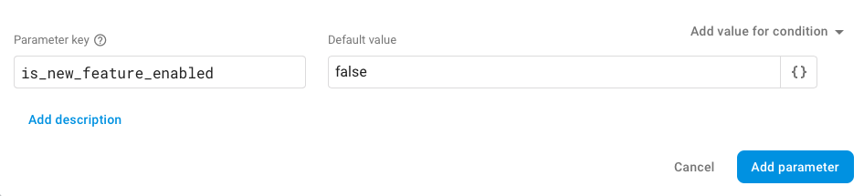
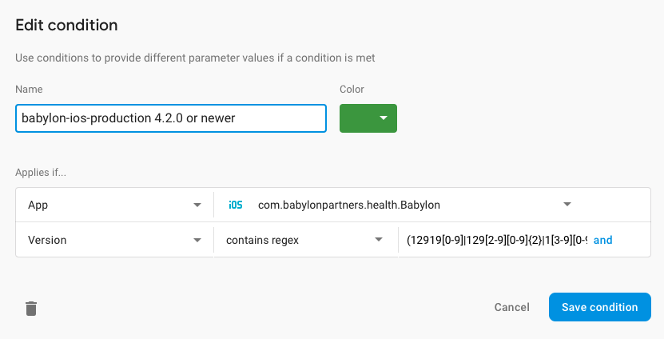

# Feature Switches

This document describes the process that should be followed when defining Features Switches.

Depending on the use case we are using different ways to define Feature Switches in our code base. A feature switch is not always some `Bool` value that can be either `true` or `false` (though most of the times it will be), it can be a more complicated type that defines a conditional behaviour.

1. **Local feature switches**

	These feature switches are defined in the `LocalFeatureSwitchesProtocol` and are stored in `UserDefaults`. **These feature switches are supposed to be used only during the development of any new feature so that the code for the feature can be integrated into the `develop` branch continuously.** As they are stored in `UserDefaults` they can be overridden during testing with Settings app. To add a new local feature switch do the following:

	1. Add a new case in the `SettingsKeys` enum for this feature flag in `LocalFeatureSwitches.swift`:

	```swift
	case isNewFeatureEnabled
	```	
	
	2. Add a new property to the `LocalFeatureSwitchesProtocol` in `LocalFeatureSwitches.swift`:

	```swift
	static var isNewFeatureEnabled: Bool { get }
	```
	
	3. Add a default implementation in the extension of `LocalFeatureSwitchesProtocol` in `LocalFeatureSwitches.swift`:

	```swift
    public static var isNewFeatureEnabled: Bool {
        #if DEBUG || ENABLE_FEATURE_FLAGS
        return valueFromDefaults(for: .isNewFeatureEnabled)
        #else
        return false
        #endif
    }
	```
	
	Note: `ENABLE_FEATURE_FLAGS` compilation condition exists so that we are able to disable all the **local feature flags** in the builds that we provide for user testing. This flag should be used **only with local feature switches**.
	
	
	4. Add a new entry in the `Root.plist` for a toggle for this feature. The key name should be the same as the raw value of the case in `SettingsKeys` added before. The entry should be added after the `PSGroupSpecifier` item named `✨ Local Feature Switches ✨` and before `✨ Remote Feature Switches ✨` (this will visually group it with other local feature switches in the Settings app)

		1. if the feature is related to the Babylon app only it is enough to add the entry to the plist located at `Babylon/Brand/babylon/Settings.bundle`
		2. if the feature is related to all our apps then the same entry should be added to the plist located at `Babylon/Supporting Files/Settings.bundle`
	
	```xml
	<dict>
		<key>Type</key>
		<string>PSToggleSwitchSpecifier</string>
		<key>Title</key>
		<string>New Feature</string>
		<key>Key</key>
		<string>isNewFeatureEnabled</string>
		<key>DefaultValue</key>
		<false/>
	</dict>
	```
	
	**Note that default values are always `false`!**

2. **Application configuration**

	Application configuration, as name implies, exists to specify application specific configuraitons, i.e. if a feature should be enabled or completely disabled for a specific app or if it should use a different content. To define a new application configuration you should add a new property to the `AppConfigurationProtocol` in `AppConfiguration.swift`. If the flag is related to a specific feature then it might be better to define it in the dedicated configuration struct/protocol, i.e. if the flag is related to `Appointments` we have `AppointmentsContentProtocol` for this purpose.
	
	A difference with other Feature Switches is that Application Configuration is used when we know that the configuration is specific to a specific _app_ (not the locale, not the user's region or their consumer network) and other apps should have the same feature configured differently. Other Feature Switches are not target specific.
	
	It's however possible to have Application Configuration switch to be "driven" by a Local Feature switch or even Remote Feature Switch. This way we can both have a flexibility of these feature switches (that we can change their values remotely or from the Settings app) but we at the same time can override this configuration for other targets and we don't have to change the way how we access the flag in the code when for example we change from a local to remote feature switch.
	
	```swift
	extension AppointmentsContentProtocol {
		public var isMyNewFlowEnabled: Bool {
			return Current.abTestingService[.isMyNewFlowEnabled]
		}
	}
	```

3. **Backend feature switches**

	These feature switches are a kind of remote feature switches and are defined on the backend (in Feature Configurator service) and come as a part of patient details and can be accessed as `patient.metadata.featureSwitches`. To add a new feature switch on the client add a new property to `BackendFeatureSwitches` struct in `BackendFeatureSwitches.swift` file and code to decode this property in `Decodable.swift`. Of course it needs to be added on the backend as well, that's something the backend dev from your team should be able to help with.
	
4. **Firebase remote config**

	These feature switches are another kind of remote feature switches and use Firebase Remote Config as a backend. To add a new Firebase remote config you need to add a new "variant" variable in the `ABTestVariant` in `ABTesting.swift` and its default to `FirebaseABTestingService.keysAndNSObjectValues`
	
	```swift
	static let isNewFeatureEnabled = makeBoolVariant(key: "is_new_feature_enabled", defaultValue: false)
	```
	
	```swift
        let keysAndNSObjectValues = [
	    ...,
	    ABTestVariant.isNewFeatureEnabled.keyAndDefault,
	]
	```
	
	Then you need to add a remote config in the [Firebase console](https://console.firebase.google.com) with the same string key. For that navigate to the `Remote Config` page in the `Grow` section of the side menu and tap "Add parameter".

	

	To control the value of this feature flag we can define values for different "conditions" which are based on the application bundle id and the build version (not the app semantic version number). You can reuse existing conditions (don't mix them with those used for Android app unless you agree to use the same flag for both platforms) or create a new condtion on the `Condtions` page. To create a new condition you need to specify the app bundle identifier and optionally a regular expression for build number (you can use http://gamon.webfactional.com/regexnumericrangegenerator/ to create it)
	
	

	**Note that default value is `false` again!**
	**Also not that condition is using a build number, even though the description mentions the app version. Be careful with these conditions when doing a release not from the head of develop branch (but i.e. doing a hot-fix release from the head of previous release) as the build numbers are constantly incremented with each CI run and don't depend on the app version.**
	


## How to decide what feature flag to use

- Q: Are you working on a bug fix or a new feature/change in the existing feature?
  A: 
    - It's a bug

       You don't need any kind of feature switch
    - It's a feature

        You may need a feature switch, read on

- Q: Have you just started to work on the feature and it will take time to finish it, probably more than one sprint?
  A: 
    - Yes, it will take some time

       Use a local feature switch
    - No, the feature is small and can be finished in one sprint

       You still may or may not need a feature switch, read on
       
- Q: Is the change related to something critical and we may want to be able to switch it back to previous implementation?
    - Yes

       While still working on the feature use a locl feature switch, when it is ready for release - convert it to Firebase Feature Switch
    - No

       Keep it as a local feature switch if you need one
   
- Q: Does the feature need to behave differently for different apps?
    - Yes

       Use Firebase feature switch with an app bundle id condition. If it's clear that feature will be availbale only for one app and not for others then it can be hardcoded in the AppConfiguration that the switch will be turned off (typically default is `false`) for particular apps. If you don't need a local or Firebase feature switch for the feature then just use AppConfiguration to define feature variants for different apps
    - No, it's the same for all the apps

       Use a local feature switch or Firebase feature switch without app bundle id condition (depending on previous answers)
       
- Q: Does the feature need to behave differently depending on the way user signs up for our services, i.e. through the partnership program or with some code?
    - Yes

       Use backend feature switch, this way it can depend on the user data, i.e. current consumer network.
    - No

       Use a local or Firebase feature switch (depending on previous answers)
       
- Q: Is there A/B test running for this feature/change?
    - Yes

       Use Firebase feature switch
    - No

       Use a local feature switch or app configuration (depending on previous answers)

## Phasing out feature switch

This is yet to be defined.

## Dos and don'ts

- Don't change the default value of the flag. We use `false` as default value for all the flags to make their behaviour more predictable and uniform (in opposite to having some flags have it `true` and some have it `false`).
- Start new feature development with a local feature switch. When you are going to release the feature convert it to remote feature switch. This way you don't have to use a regular expression on Firebase (if you use Firebase remote config) all the time, only if you need to change the value of the flag _after_ it was released.
- Do not introduce feature flags that affect each other. Each feature flag increases testing complexity as it introduces new combinations.
- Try to limit the usage of the feature switch using design patterns like strategy, delegate, facade etc.
