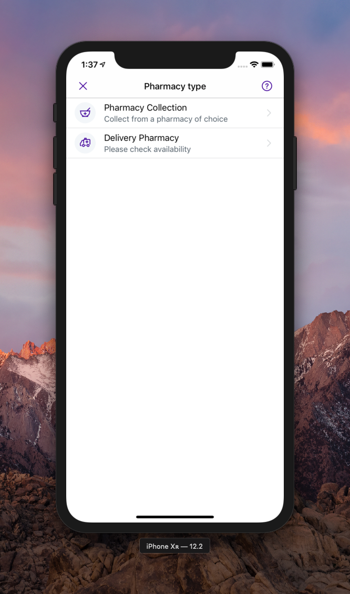
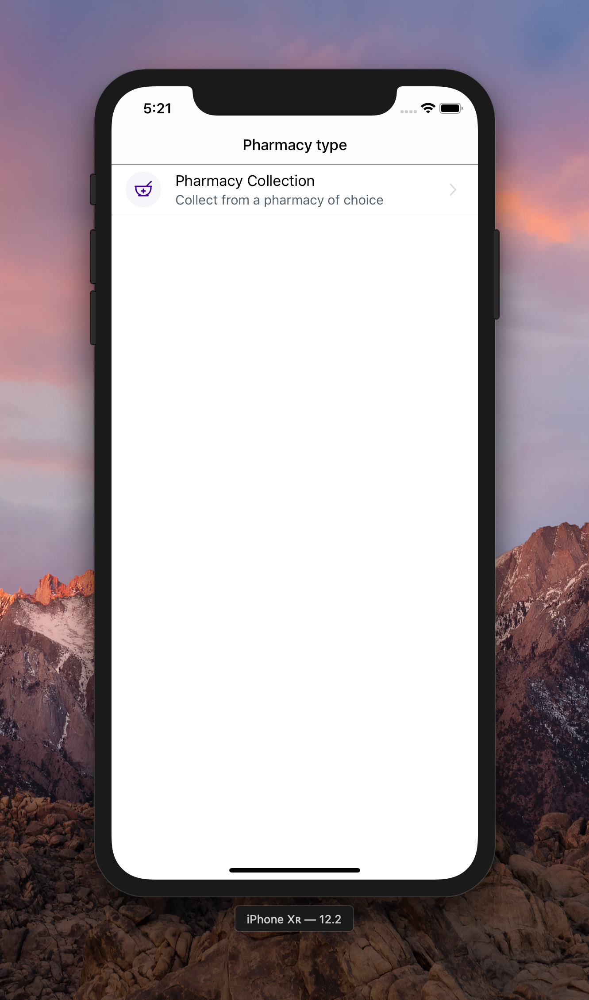

#  From 0% to 100% screen with Bento
In this article, we would like to answer a few questions regarding Bento. If you are a new person in the team and you have questions like: 
- **"What is Bento?"**, 
- **"Why do we use it?"**, 
- **"How should I use it?"**,
- **"What's renderable?"** 

then the article is for you. However, we assume you are already kind of familiar with our [Architecture](https://github.com/babylonhealth/ios-playbook/blob/master/Cookbook/Technical-Documents/Architecture.md).

## What and why?
First of all, Bento is our **internal library** which allows us to write UI code in a declarative way. This makes it faster to write the UI code. 

Bento now is our internal library however it used to be an **open-source** project. It has changed when Apple announced SwiftUI at WWDC 2019. We decided to move it under the main repo back then.

The format of this article will be a step by step guide on how to implement your first **Renderer**. Let's build something! 🏗

## This is what we want to build


## Renderer
As I said before, I assume you are already kind of familiar with our Architecture. In this article, we are going to focus on the **renderer** part. 

Renderer's purpose is to **calculate** a UI. We used the word calculate on purpose as we express our UI as a function of state `UI = f(state)`. The function is named `func render(state: ViewModel.State) -> Screen<SectionId, ItemId>`.

First things first. To create a Renderer you need to create a struct and conforms to `BoxRenderer`. This is what you get from the Xcode's template.

```swift
struct ChoosePharmacyTypeRenderer: BoxRenderer {
    private let config: Config
    private let observer: Sink<ChoosePharmacyTypeViewModel.Action>

    init(
        observer: @escaping Sink<ChoosePharmacyTypeViewModel.Action>,
        appearance: BabylonAppAppearance,
        config: Config
    ) {
        self.config = config
        self.observer = observer
    }

    func render(state: ChoosePharmacyTypeViewModel.State) -> Screen<SectionID, NodeID> {
        return Screen(title: "", box: .empty)
    }

    struct Config {
        let bundle: Bundle

        init(bundle: Bundle = .main) {
            self.bundle = bundle
        }
    }
}

extension ChoosePharmacyTypeRenderer {
    enum SectionID: Hashable {
        case first
    }

    enum NodeID: Hashable {
        case first
    }
}

```

Going from the top the first question you may ask is **"What's a Config"**. As a result of how `BoxRenderer` is coupled with `BabylonBoxViewController` we cannot pass dependencies as we usually do in an init. Config is a way of **injecting dependencies** into a renderer.

</br>

 > 12 Aug 2019 - Renderer has to be a struct as there is a problem with classes & memory management as classes are not deallocated. It may be fixed someday but it's still the case when I'm writing this article.

</br>

Now let's jump into the `render(state:)`. It returns a Screen. This is how a Screen may look like:
```swift
    return Screen(
        title: screenTitle,
        rightBarItems: [faqButton],
        shouldUseSystemSeparators: false,
        box: render(state),
        pinnedToBottomBox: renderBottomButtons(state)
    )
```

With Screen, you can modify many behaviours like the **alignment** of the content on the screen, whether you want the **system's separators** or not. If you need to modify something which cannot be represented by a box please take a look at the init of the `Screen`. Variables there are pretty self-explanatory.

#### What's the Box then?

You can think of a `Box` as a representation of `UITableView` or `UICollectionView` in the context of Bento. `Box` is made up of **Sections** and in sections there are **nodes**. Section is a representation of `UITableView`'s section while `Node` is a corresponding type to a row.

Let's display the first row. The first thing we need to do is to create a `Screen`:

```swift
    func render(state: ChoosePharmacyTypeViewModel.State) -> Screen<SectionID, NodeID> {
        return Screen(
            title: Localization.NHS.Prescriptions.pharamcyTypeTitle,
            shouldUseSystemSeparators: true,
            box: renderOptions()
        )
    }
```

`renderOptions()` job is to return `Box<SectionID, NodeID>`:

```swift
  private func renderOptions() -> Box<SectionID, NodeID> {
        return .empty
            |-+ Section(id: .first)
            |---+ Node(
                id: .collection,
                component: appearance.row3(
                    title: Localization.NHS.Prescriptions.collectionPharmacyOptionTitle,
                    detail: Localization.NHS.Prescriptions.collectionPharmacyOptionSubtitle,
                    image: Icon(
                        template: appearance.tokens.icons.image(.pharmacy),
                        backgroundColor: appearance.tokens.colors.grey50
                    )
                )
        )        
    }
```

There is a little bit of magic in the snippet above. Let's define what is what:

1. `.empty` returns an empty `Box` on which we can use Bento's operators
2. `|-+` operator adds a Section into the box
3. `|---+` adds a Node into a Section

With `|-+` and `|---+` you can add many sections and rows into your Box.

Sections and Nodes take an ID as their arguments. The ID is needed for diff algorithm to calculate changes between each UI calculation. ID is represented by enums (`enum SectionID` and `enum NodeID`).

</br>

> Very often there is only a single Section on the screen. In that case, we name this Section's id as "first".

</br>

`Node` also takes a `component` which is a representation of a **cell** displayed on the screen. A component is a `Renderable`. With minimal luck, you won't need to create a component on your own as it's waiting for you to be used inside **the Design Library**. Your job is to only fill it with values.

Design Library is a library of **reusable** components created **both** by designers and developers. Whenever a designer from your squad needs to create a new screen, they should use components from that library which can be found in Zeplin. 

From a developer's point of view, the Design Library is a builder pattern with many functions, each returning a component. You can access the design library via `appearance` property in a renderer. In the above example, we used `row3`. 

</br>

> In our codebase, there is an additional scheme & target called "GalleryApp". You can find there all Design Library components which have been written so far.

</br>

At this point you should be able to run the app and see the following:



To display the 2nd row, you just need to add another row to the box:
```swift
    private func renderOptions() -> Box<SectionID, NodeID> {
        return .empty
            |-+ Section(id: .first)
            |---+ Node(
                id: .collection,
                component: appearance.row3(
                    title: Localization.collectionPharmacyOptionTitle,
                    detail: Localization.NHS.Prescriptions.collectionPharmacyOptionSubtitle,
                    image: Icon(
                        template: appearance.tokens.icons.image(.pharmacy),
                        backgroundColor: appearance.tokens.colors.grey50
                    )
                )
            )
            |---+ Node(
                id: .delivery,
                component: appearance.row3(
                    title: Localization.NHS.Prescriptions.deliveryPharmacyOptionTitle,
                    detail: Localization.NHS.Prescriptions.deliveryPharmacyOptionSubtitle,
                    image: Icon(
                        template: appearance.tokens.icons.image(.ambulance),
                        backgroundColor: appearance.tokens.colors.grey50
                    )
                )
            )
    }
```

To make it more readable you can extract helper functions:

```swift
    private func renderOptions() -> Box<SectionID, NodeID> {
        return .empty
            |-+ Section(id: .first)
            |---+ renderCollectionOption()
            |---+ renderDeliveryOption()
    }

    private func renderCollectionOption() -> Node<NodeID> {
        return Node(
            id: .collection,
            component: appearance.row3(
                title: Localization.NHS.Prescriptions.collectionPharmacyOptionTitle,
                detail: Localization.NHS.Prescriptions.collectionPharmacyOptionSubtitle,
                image: Icon(
                    template: appearance.tokens.icons.image(.pharmacy),
                    backgroundColor: appearance.tokens.colors.grey50
                )
            )
        )
    }

    private func renderDeliveryOption() -> Node<NodeID> {
        return Node(
            id: .delivery,
            component: appearance.row3(
                title: Localization.NHS.Prescriptions.deliveryPharmacyOptionTitle,
                detail: Localization.NHS.Prescriptions.deliveryPharmacyOptionSubtitle,
                image: Icon(
                    template: appearance.tokens.icons.image(.ambulance),
                    backgroundColor: appearance.tokens.colors.grey50
                )
            )
        )
    }
```

#### Handle tapping on a row
Right now you should be able to see 2 rows; however, tapping on them does nothing. 

A user's input (as any other event) can change ViewModel's state. As a result, a user's input also needs to go through Feedback dance in a ViewModel. To distinguish user's inputs from other events, in ViewModel there is an `enum Action`. Renderer gets a closure in the init called `observer` which takes an `Action` and passes it to a ViewModel. All you need to do is to **send** a proper `Action` into the `observer`:


```swift
    private func renderCollectionOption() -> Node<NodeID> {
        return Node(
            id: .collection,
            component: appearance.row3(
                title: Localization.NHS.Prescriptions.collectionPharmacyOptionTitle,
                detail: Localization.NHS.Prescriptions.collectionPharmacyOptionSubtitle,
                image: Icon(
                    template: appearance.tokens.icons.image(.pharmacy),
                    backgroundColor: appearance.tokens.colors.grey50
                ),
                didTap: ^Action.didTapPharmacyCollection >>> observer
            )
        )
    }

    private func renderDeliveryOption() -> Node<NodeID> {
        return Node(
            id: .delivery,
            component: appearance.row3(
                title: Localization.NHS.Prescriptions.deliveryPharmacyOptionTitle,
                detail: Localization.NHS.Prescriptions.deliveryPharmacyOptionSubtitle,
                image: Icon(
                    template: appearance.tokens.icons.image(.ambulance),
                    backgroundColor: appearance.tokens.colors.grey50
                ),
                didTap: ^Action.didTapPharmacyDelivery >>> observer
            )
        )
    }
```

The `^` and `>>>` are our operators to simplify our codebase. The `^` is a lift operator which lifts single value `Action.didTapPharmacyCollection` into a function `() -> Action`. Why do we need to do so? The `>>>` composition operator needs 2 functions `(A -> B) >>> (B -> C) = (A -> C)`. In our case it's `(Void -> Action) >>> (Action -> Void) = (Void -> Void)` where `didTap` requires `Void -> Void`. Everything matches! 

</br>

> To find out more on functional operator in our code base check out [this article](https://github.com/babylonhealth/ios-playbook/blob/master/Cookbook/Technical-Documents/FunctionalOperators.md).

</br>

#### Multiple rows
`---+` operator allows you only to append a single node to a section. Very often we need to display a list of models. Bento has also `---*` operator which serves this purpose. This is how it would like in the code:

```swift
func renderList(of prescriptions: [Prescription]) -> Box<SectionID, NodeID> {  
	return .empty
		|-+ Section(id: .first)
		|---* prescriptions.map { prescription in
			return Node(
				id: .prescription(prescription.id),
				component: appearance.row1(title: prescription.drugName)
			)
}
     
enum NodeID {
    case prescription(id: String) 
}
```

## How can I create a fresh new component?
Sometimes we need to create a new component. Usually, it's because the component hasn't been used by another iOS dev. 

What's the process? First of all, look at the checklist what needs to be done:

### New component checklist
1. Check if the component is in Zeplin under `Design System` tag. Chase a designer if it's not there :)
2. If the component is there, you can implement it by adding a factory method as an extension of the ComponentsBuilder `extension DesignLibrary.ComponentsBuilder`
3. Record snapshot tests
4. Add a demo of the component into GalleryApp

### Writing a new component
Here we're going to focus on point 2. We are going to write a banner component:


We build components by putting **small blocks together**, usually in a StackView. By small blocks, we mean other components which we call `atomic components`. They are called `atomic` because those components are small, usually display a **small unit** as Label, ImageView, plain UIView.

The banner can be build from 2 images and 1 label. Let's put them all into a stack view:

```swift
    public func banner(
        description: String,
        leadingIcon: UIImage? = nil,
        trailingIcon: UIImage? = nil,
        iconsColor: UIColor? = nil,
        didTap: (() -> Void)? = nil
    ) -> AnyRenderable {
        return [
            leadingIcon.map { UI.Image(image: $0.withRenderingMode(.alwaysTemplate)) },
            UI.Label(text: description),
            trailingIcon.map { UI.Image(image: $0.withRenderingMode(.alwaysTemplate)) }
        ]
        .stack(axis: .horizontal, spacing: 8, layoutMargins: 8)
        .asAnyRenderable()
    }
```

As you can see, we used 3 atomic components and then we put them all into a stackView.

The code above compiles however it doesn't look like the design image. First of all, images should have fixed size and we should set `tintColor` on them as we use `.alwaysTemplate` rendering mode. We just need to add a few more operators:


```swift
    leadingIcon.map {
        UI.Image(
            image: $0.withRenderingMode(.alwaysTemplate)
        )
        .tintColor(iconsColor)
        .height(24)
        .width(24)
    },
```

`tintColor`, `height` and `width` are 3 from many operators we have available in the codebase. They have been written in a way so the usage & syntax remind of SwiftUI.

Now is also a time to style the label:
```swift
    UI.Label(
            text: description
    )
    .textColor(tokens.colors.white)
    .font(font(fontAttributes: tokens.typography.body))
    .textAlignment(.center)
    .lineBreakMode(.byWordWrapping),
```

As the last thing we need to put all we have into a container and fill it with purple'ish color:

```swift
    .stack(axis: .horizontal, spacing: 8, layoutMargins: 8)
    .container()
    .backgroundColor(tokens.colors.primary)
```

This is how the entire function looks like:

```swift
    public func banner3(
        description: String,
        leadingIcon: UIImage? = nil,
        trailingIcon: UIImage? = nil,
        iconsColor: UIColor? = nil,
        didTap: (() -> Void)? = nil
    ) -> AnyRenderable {
            return [
                leadingIcon.map {
                    UI.Image(
                        image: $0.withRenderingMode(.alwaysTemplate)
                    )
                    .tintColor(iconsColor)
                    .height(24)
                    .width(24)
                },

                UI.Label(
                    text: description
                )
                .textColor(tokens.colors.white)
                .font(font(fontAttributes: tokens.typography.body))
                .textAlignment(.center)
                .lineBreakMode(.byWordWrapping),

                trailingIcon.map {
                    UI.Image(
                        image: $0.withRenderingMode(.alwaysTemplate)
                    )
                    .tintColor(iconsColor)
                    .height(24)
                    .width(24)
                }
        ]
        .stack(axis: .horizontal, spacing: 8, layoutMargins: 8)
        .container()
        .backgroundColor(tokens.colors.primary)
        .asAnyRenderable()
    }
```

Of course in production code, it would be nice to **extract** a few helper functions to have a **smaller** banner function. 

#### Stylesheets (Deprecated)
In the implementation of Bento you may find some classes called Stylesheets. Those are an **old way** of styling our views before we had operators like `.backgroundColor(_ color: UIColor)` or `.font(_ font: UIFont)`. Stylesheets used to define **how** a view looks like. Keep in mind that now Stylesheet's usage should be limited and **replaced with operators**.

## Summary
Generally speaking, Bento is our implementation of SwiftUI as we have started to use it at least a year before SwiftUI was announced. 

The most important thing about Bento is it uses a UITableView or UICollectionView to render view and that's why it needs additional types as `Box` `Section` and `Node`.

`DesignLibrary` is also used very close with Bento as from `DesignLibrary` we have all the **components** we can use to build screens with `Bento`. Keep in mind that **components** are not UIView subclasses. They are **light-weigh** structs based on which UIView classes are created later on.

If you have any ideas on how this article can be improved let us know and don't forget... **"We accept PRs"** 😉
