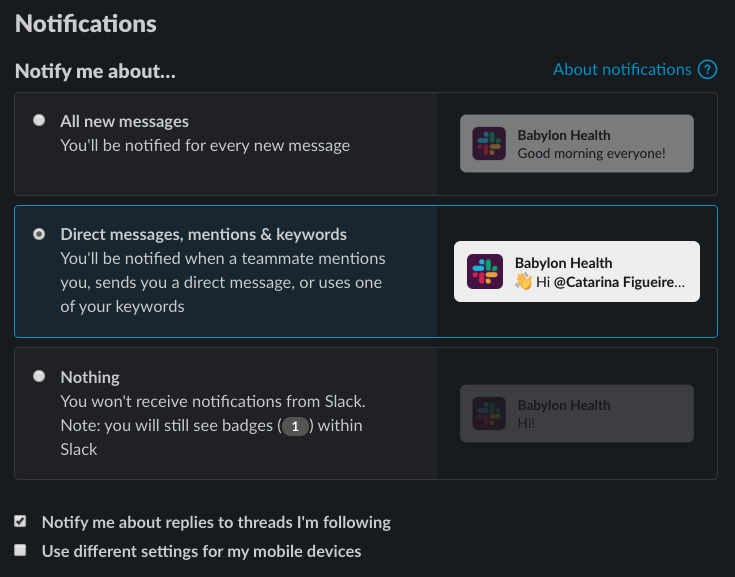
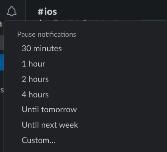

# How to use Slack?

In Babylon we try to be as much remote friendly as we can.
Slack is a tool we rely on a lot to help us communicate with everyone without having to be physically present.
On the first day at Babylon, one of the first things you have automatically access is to your Slack account.
Although this is a pretty straight forward instant messaging tool, there a few rules and tips everyone should be aware.

## Which channels to join?

### #ios
The channel for any babylonian to reach the iOS Team. This channel should be regularly checked by the iOS support engineers.

### #ios-underground
The private channel for the iOS Team. It's the place to raise problems, have discussions, make the team aware of your whereabouts or just to say "Good morning 👋".

### #ios-meeting-outcomes
The private channel to post the outcomes from the iOS team meetings.
Each message represents a meeting and should have the following format:

```
**<title>, <date>**
<what was discussed>
Recording: <recording link>
```
Example:

```
**Retro, 11th Nov 2019**
Board: https://trello.com/b/8OC8ahZz/retro-11th-nov-2019
Actions: For @catarina to change the PR Party documentation to address the changes in the process that were discussed.
Recording: https://babylonhealth.zoom.us/recording/share/2q99Zb7Oxg0Kk7yIAVITuGUZVCs2_eV7Vge2Ppmjq3WwIumekTziMw
```

### #ios-pedia
A private channel used to make announcements or to open discussions on broader topics within the iOS Team.
Each announcement or discussion should be just one message and the discussion should happen within that message thread.
To understand the status of a message we tag the messages following:

- In discussion 💬
- No outcome ❎
- With outcome ✅
- Announcement ⚠️

To be easier to identify the topic of the message we use:
 `[<topic of the message>] message`

Example: 

```
[Peakon] Please make sure you feel the Peakon survey frequently and give as much feedback as you can. Please do not ever think your feedback is not relevant enough to write it down. I can guarantee you every feedback is important for us and it will always help us get better at what we do.
Your help is very much appreciated!
Thank you :thanks:
```

### #ios-questions

A private channel where the iOS engineers can post any technical question and it will be answered by anyone in the iOS Team.
The questions should be a message in a channel and the reply should be withing the message's thread.
Ideally follow the stackoverflow approach and state what you tried.

The question should follow the format:
`[<topic of the question>] question`

Example:
```
[RAF] What is an example with the newest style for a page where a child triggers some events in a parent? What is best to inject, and from where?
```

### #ios-build

A public channel where we usually trigger CI workflows like Testfligh/AppCenter builds or UI Automation Tests.
The UI Automation Tests run every night and the results are published in this channel.
To check how to trigger the workflows check [Slack CI Integration](/SlackCIIntegration.md)
## How to manage notifications?

Slack notifications are great to make sure we don't miss anything important. However, when they are very frequent they can disturbe our work and our productivity.

There are a few tips to try to reduce the number of notifications to the ones that really matter to you:

### Global notification preferences

To reduce overall number of notifications we can configure the notifications on Slack doing the following:

1. Go to Slack > Preferences > Notifications
2. Configure your notifications with:



3. Go to `My keywords` and define the keywords to be used to trigger notifications. These can be your nicknames and variations of your name.

4. In the `Do Not Disturb` you can set the time interval you don't want to receive any Slack notification. Ideally this should enabled during your non-working hours.

On the day to day basis, if you want some quite time, you can mute notifications temporarly by selecting the notifications icon next to your Slack organization name and selecting one of the options.



### Leave the channel

When you leave a channel you can no longer open it unless you join it again. Also, when someone shares a thread from that channel with you, you will have to join the channel to be able to read it.
When the channel is private, if you leave it you will have to be invite by one of the members to join it again.

You should leave a channel when:
 - You haven't open it in the last month.
 - The subject is no longer relevant.

### Mute the channel


 - The subject is not your main focus but you like to keep yourself updated on what is happening.
 -   
1. You joined a channel but you haven't looked at it in the last month - leave that channel.
2. You joined a channel, you like to check it from time to time but it is not your main focus - you can unmute that channel so you can still visit it but you won't receive any notification if someone uses `@channel`, `@here` or `@<your username>`.
3. 


## How to communicate my schedule?
