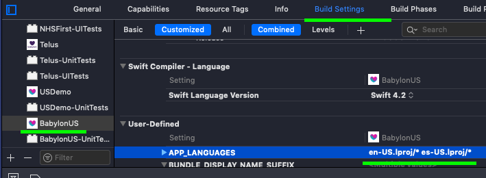
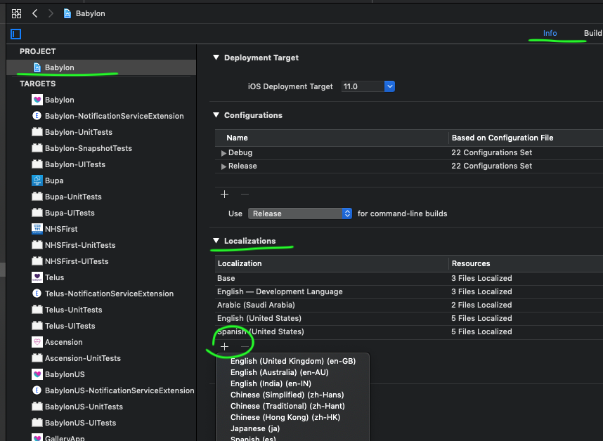

# How to deal with Localizations

In our project we can add a new Localization. But that is not in target level. Babylon needs to have different sets of languages/locales per product.

| Babylon and NHS111 | BabylonKSA | Telus | Babylon US and Ascension |
|--------|--------|--------|--------|
| - British English | - Arabic | - Canadian English<br>- Canadian French (soon) | - American English<br>- American Spanish |

## Build Settings
### Understanding `app_languages` variable
Given that, we manage our languages in an array in Build Settings in each target.

| Babylon UK | Babylon KSA | Telus | Babylon US and Ascension |
|--------|--------|--------|--------|
| `en.lproj/*` | `en.lproj/*` `ar-SA.lproj/*` | `en.lproj/*` `fr-CA.lproj/*` | `en-US.lproj/*` `es-US.lproj/*` |

**I.E we control the languages for each target editing the `APP_LANGUAGES` under _User-Defined_**



### _Excluded Source File Names_ and _Included Source File Names_ under `Build option`
In the _Excluded Source File Names_ we exclude any language (`.lproj/`) previously set:
`*.lproj/*` 

In the _Included Source File Names_ we include the languages (`.lproj/`) set in the above mentioned `app_languages` array:
`${APP_LANGUAGES}` in Babylon US for example it is `en-US.lproj/*` `es-US.lproj/*`.

## How to add a new or changing an existing key/value
### Add a new key/value
In Lokalise, select the corresponding project. 
Click on the `Add key ⌘K` button
- `key` - Give a name for the key following the bread-crumb style. For example: `add_family_member_email_placeholder`, `biometric_touchid_primer_description`.
    
- `Base language value`: The actual string value corresponding to the first language in the list. Placeholders are supported with the `%@` where dynamic values are expected. 

Note: the translations will be done by a third party that has access to lokalise and it should be done and notified by your squad.

### Edit a key/value
Search and select the key you'd like to update and change any language you need. The languages you may not have the values will be marked as `Not-verified` and the translators will take care.

## How to add a new Language/Locale

### 1. Xcode: create Files if needed
- Select the Babylon Project / Info / Localizations then click on the `+` button and choose the Language/Locale you want to add.


- Select the `.strings` file in the Project Navigator, review it in the File Inspector / Localization and select the language/locale you want.
- In `Fastlane/Lanes/lokalise`, add the language/locale code (`en_US` for example) in the `langs` parameter for the desired target. `langs: 'es_US,en_US'` (**comma separated without space**). 

### 2. Lokalise.co
- If the project still doesn't exist, click on the `+` plus button beside other flags. Find the desired language on the list, and then add it.
Note: someone else from your squad should have done this before.

#### 2.1 Populate the files - pull from lokalise
- Check [Lokalise pull guide](https://github.com/Babylonpartners/ios-playbook/blob/master/Cookbook/Technical-Documents/Lokalise.md).

#### 2.2 Commit just your changes
Stage just your changes (additions and editions) on git. Don't stage any additions nor change that you don't recognize. It's really nice to be proactive but not in this case. It might cause unexpected/premature changes. Yes, discard others's changes.

## Target specific localizable - Lokalise project and `strings` files

As the name suggests, it's a `.strings` file that contains texts intended to be present **only** in a specific app target.
The values in this file will be priority over the main file value.
<br><br>
E.g: <br>
In `Babylon/Supporting Files/Localization/Localizable.strings`:<br>
```"consultation_gp_details_name" = "GP Name:";```<br>
<br>
And in `Babylon/Brand/Telus/TargetSpecificLocalizable.strings`:<br>
```"consultation_gp_details_name" = "Doctor Name:";```<br>
<br>
When we run the target **Telus**, the value will be taken from the target specific file.
`Doctor Name:`

Whereas when we run **Babylon** the value will be the main one. 
`GP Name:`

This prioritization happens in the static method [`LocalizationCore.localizedName`](https://github.com/Babylonpartners/babylon-ios/blob/develop/SDK/BabylonCore/BabylonCore/Utilities/LocalizationCore.swift#L14) that basically tries first to get the value for such key from the target-specific file and if the result is still the key itself, then it falls back to the main value. 

```swift
public static func localizedName(key: String, bundle: Bundle = Bundle.main) -> String {
    let targetLocalizationString = NSLocalizedString(key, tableName: "TargetSpecificLocalizable", comment: "")
    let targetHasKey = targetLocalizationString != key
    return targetHasKey ? targetLocalizationString : NSLocalizedString(key, bundle: bundle, comment: "")
}
```

Such approach allows other targets to have their custom keys' values when, for some reason, the user uses the device in British English.

Not only that, but also avoids us to have useless and risky repetitions like:<br>
```"consultation_gp_details_name_babylon" = "GP Name:";```<br>
```"consultation_gp_details_name_telus" = "Doctor Name:";```<br>
in the same file released for all apps. 

### How to create a key/value that goes to this file? (lokalise key configuration + fastlane output file location)
Considering you are working in an app (different than the main Babylon UK). A project in Lokalise is needed. Then when you need to have a custom value for a certain key. 

#### In www.lokalise.co:

1. Create a new key: Click on the `Add key ⌘K` button
2. Add the exact same key as it is in the Babylon (Lokalise) Project. Also its custom value.
3. Click on `Advanced` and in `Assigned to file` select in the dropdown `TargetSpecificLocalizable.strings`. If it's the first time, `New file...` then add the before mentioned `TargetSpecificLocalizable.strings`.

#### In `Babylon/fastlane/Lanes/lokalise`:
1. Create a lane that will pull the string values into the custom file:
Consider that the app name here is `FooBar` and that you have the real `projectId` from Lokalise:
```ruby
# lokalise_pull FooBar
lane :lokalise_pull_foobar do
	lokalise_pull(
		projectId: "0000000000000000000000.11111111", 
		destinationFolder: "../Babylon/Brand/FooBar/",	
		noLanguageFolders: "1", 
		langs: "en, fr"
	)
end
```
2. The detail to highlight here is the `destinationFolder: "../Babylon/Brand/FooBar/"` combined with the given `fileName` in each key entry, it'll compose the full path of the custom file. 

3. The last detail to take care are the `langs` that should reflect the `APP_LANGUAGES` array in the app target's Build Settings / User defined. 

4. Then finally run the brand new command: 
```sh
bundle exec fastlane lokalise_pull_foobar
```
The new target specific file should appear in your git diff. ✨

## Lokalise: add comments and screenshots when possible.
Comments and screenshots are important complementary **contexts** for the translators. For that, in the key/value edition screen (on lokalise.co) go to `Advanced` tab, and add a comment on the `Context` field. To upload screenshots, click on the "photo" icon in the keys list and upload them. 
Imagine that when the translators started the Arabic work, they saw the call-to-action `Book` for Book an appointment screen. Then without any comment nor screenshot, that has been translated **litterally** as book 📚📖 (the object that has pages that we read). As an Engineer you should understand that context is crucial. A quick comment and screenshot made in 5 minutes, might save hours of back and forward to fix a misunderstanding of meaning throughout engineering, management, translators and in this case, AppStore approval proccess. 


