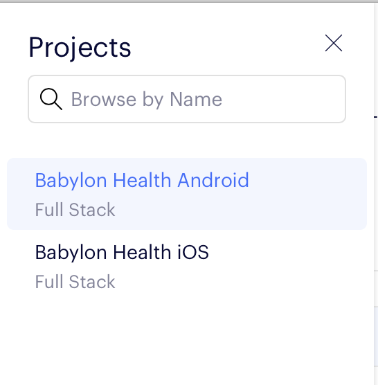

Working with Optimizely
=======================

[Optimizely](https://www.optimizely.com) is a tool for full stack software experimentation. Its two main concepts are Experiments and Features. In an experiment users are divided into two or more segments, each segment is shown a different version of the user interface and we try to collect some performance data to decide which version works best. A feature is a flag which decides whether something is available for a specific user.

## Interacting with the Optimizely Portal
Optimizely is not available in our single sign on portal. To create an account you need an administrator to send an invite to your Babylon email. Once you have registered you can [sign in here](https://app.optimizely.com/signin)

After you have signed in, select "Babylon Health iOS" under the project heading in the left hand menu.



As a front end developer you are most likely to be interested in the content under "Experiments" and "Features".

## Setting up Optimizely Experiments
Typically you will only need to worry about the variations. Other parts of an Optimizely experiment mainly concern analytics and product management.

To fetch the variation that the user has been assigned to you need to define a type that would contain the value of this variation:

```swift
enum AwesomeExperiment: String {
  case A, B
}

@ABTestVariant(key: "awesome_experiment", defaultValue: .A)
let variant: AwesomeExperiment
```

Note that experiments can have any number of variations, but more than two will be unusual as it gets more difficult to collect conclusive data.

## A/B Tests vs Feature Tests

Optimizely unlike other services has different kinds of tests: A/B tests and feature tests. Feature tests are built around some feature switches and to create such test you would need to already have or create a feature switch. A/B tests on the other hand are not related to feature switches and only provide the client app with the value of variation as a string. It's up to the client to process this value and decide how the behaviour of the client should change. 

Feature tests serve the purpose of testing in what configuration a feature works better. As Optimizely feature switches can have associated variables, when defining feature test variations you can define not only if the feature is enabled or not, but also different values for these variables.

When defining an _A/B test_ in code you should use the _key of this test_ as a key of `ABTestVariant`. When defining a _feature test_ you should instead use the _feature key_, not the test key. 

With feature tests you never need to access the test itself, assigned variation will be activated by Optimizely SDK under the hood (unlike for A/B tests, for which we call activation function manually when you first access the variation value). Active variations are observed both for A/B tests and feature tests and reported to analytics so you don't need to do that manually.

For more information, see the Optimizely documentation on [feature tests](https://docs.developers.optimizely.com/full-stack/docs/run-feature-tests) and [A/B tests](https://docs.developers.optimizely.com/full-stack/docs/run-a-b-tests).

## Working with Optimizely Features

Querying Optimizely for feature flags is as simple a defining a boolean property annotated with `ABTestVariant` property wrapper. Similarly A/B test defined as enum with string raw value just needs a property of this enum type annotated with `ABTestVariant` property wrapper. When accessed for the first time Optimizely will activate appropriate variation for the current user (it then will be cached in memory until the app is restarted).

> Note (November 2019): Querying Optimizely to see whether a feature is available currently yields false both when the feature is disabled and when an error occurs. This is inconsistent with their documentation so there is some hope that this will be changed in a future version of the SDK.

With Optimizely it is also possible to define "feature variables". To fetch the value of a feature variable it is necessary to pass both the feature key and variable key to the Optimizely SDK. Typically feature variables are associated with some "feature test" (it is similar to A/B test but this kind of tests are built around particular feature flags rather than just some arbitrary variations). To access variable values use `ABTestVariantDecoder` methods `boolValue(key:)` and `stringValue(key:)`.

```swift
struct AwesomeExperiment: ABTestVariantDecodable {
	static let default = AwesomeExperiment(isEnabled: false, stringVariable: "default", boolVariable: false)

	let isEnabled: Bool
	let stringVariable: String
	let boolVariable: Bool
	
	init(decoder: ABTestVariantDecoder) throws {
		isEnabled = try decoder.boolValue()
		if isEnabled {
			stringVariable = try decoder.stringValue(key: "string_variable")
			boolVariable = try decoder.boolValue(key: "bool_variable")
		} else {
			stringVariable = Self.default.stringVariable
			boolVariable = Self.default.boolVariable
		}
	}
}
```

As you can notice this is similar to how we typically implement `Decodable` protocol. You shouldn't access feature variables when feature is not enabled so always check for that first.

## Detecting Updates
We are bundling a downloaded Optimizely data file which should contain values for everything that does not require network access. Optimizely will at boot time and periodically thereafter attempt to download a new version if there are any updates. By subscribing to the `dataUpdated` signal you will be notified if the data file has been updated.

```swift
public protocol ABTestingServiceProtocol {
    func tearDown()
    func value<T>(for: ABTestVariant<T>) -> T
    var dataUpdated: Signal<Void, NoError> { get }
}
```

The latest value will always be returned for a feature flag. Experiments should never return a changed activation.

When and how to react to an updated feature flag depends on the situation. It is clearly not a good experience if the user interface is updated half-way through a flow but it might be okay to update the content of a tab once the user has navigated to another tab.

## Posting Meta Data to Optimizely
Optimizely allows us to post meta data that can be used to calculate what activation to assign, whether a feature is enabled or what feature value to return. At the moment this can be done by creating a `ABTestVariant` with attributes passed in a `[String: Any]` dictionary. It might very well be that we want to have a more type safe API, but during the initial integration of Optimizely (October 2019) it was not clear how an improved API should look.

The bundle identifier, short version string, major version number, minor version number and patch version number are always added to the meta data attributes that posted to Optimizely when querying a feature or feature variable.

## Improving the Internal API
Optimizely behaves in a way that we did not expect from a remote feature flag service when we modelled our `ABTestingService` internal API. Consequently it is rather awkward to interact with Optimizely through our internal feature flag facade. Our internal API is also not making any difference between an AB test and a feature flag. During the initial integration we decided to not refactor the AB testing facade. The reason for this is that there is an accepted proposal for tidying up the AB testing facade and stop treating AB tests and feature flags on an equal footing. It is expected that we can make the Optimizely integration to be more intuitive and convenient as part of that refactoring.
