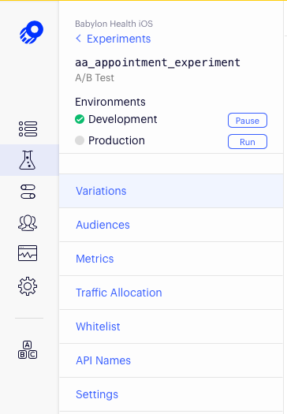

Working with Optimizely
=======================

[Optimizely](https://www.optimizely.com) is a tool for full stack software experimentation. Its two main concepts are Experiments and Features. In an experiment users are divided into two or more segments, each segment is shown a different version of the user interface and we try to collect some performance data to decide which version works best. A feature is a flag which decides whether something is available for a specific user.

## Interacting with the Optimizely Portal

Optimizely is available through our single sign on portal so you can [sign in](https://app.optimizely.com/signin) using SSO and just provide your Babylon email. 

After you have signed in, select "Babylon Health iOS" under the project heading in the left hand menu.


As a front end developer you are most likely to be interested in the content under "Experiments" and "Features".

## Setting up Optimizely Feature flags and experiments

Querying Optimizely for feature flags is as simple as defining a boolean property annotated with the `RemoteFeatureSwitch` property wrapper. When accessed for the first time, Optimizely will activate the appropriate variation for the current user (it then will be cached in memory until the app is restarted).

> Note (November 2019): Querying Optimizely to see whether a feature is available currently yields false both when the feature is disabled and when an error occurs. This is inconsistent with their documentation so there is some hope that this will be changed in a future version of the SDK.

```swift
@RemoteFeatureSwitch(key: "awesome_feature")
let awesomeFeature: Bool
```

With Optimizely it is also possible to define "feature variables". To fetch the value of a feature variable it is necessary to pass both the feature key and variable key to the Optimizely SDK. Typically feature variables are associated with some feature test and can be accessed via implementing `RemoteFeatureSwitchDecodable` protocol.

```swift
struct AwesomeExperiment: RemoteFeatureSwitchDecodable {
    static let `default` = AwesomeExperiment()
    
    let isEnabled: Bool
    let stringVariable: String
    let boolVariable: Bool

    private init() {
      isEnabled = false
        stringVariable = ""
        boolVariable = false
    }
    
    init(decoder: RemoteFeatureSwitchDecoder) throws {
        guard try decoder.isEnabled() else {
            self = Self.default
            return
        }
        isEnabled = true
	  stringVariable = try decoder.stringValue(for: "string_value")
	  boolVariable = try decoder.boolValue(for: "bool_value")
    }
}

@RemoteFeatureSwitch(key: "awesome_experiment", defaultValue: .default)
let awesomeExperiment: AwesomeExperiment
```

As you can see, this is similar to how we typically implement the `Decodable` protocol.

A/B tests in Optimizely is a variation of tests that is not based on a feature flag but on a number of variations. The best way to define it is using an enum and `ABTest` property wrapper:

```swift
@ABTest(key: "signup_test", default: .sign_up)
var signUpTitle: SignUpTitle

enum SignUpTitle: String {
    case sign_up, get_started

    var title: String {
        switch self {
            case .sign_up: return "Sign Up"
            case .get_started: return "Get Started"
        }
    }
}
```

Note that experiments can have any number of variations, but more than two will be unusual as it gets more difficult to collect conclusive data.

Tracking of active variants both for feature switches and for A/B tests is done automatically and generally does not require any additional implementation.



To learn more about feature switches read [Feature Switches guide](./FeatureSwitches.md)

## Detecting Updates
We are bundling a downloaded Optimizely data file which should contain values for everything that does not require network access. Optimizely will at boot time and periodically thereafter attempt to download a new version if there are any updates. By subscribing to the `dataUpdated` signal you will be notified if the data file has been updated.

```swift
public protocol ABTestingServiceProtocol {
    func tearDown()
    func value<T>(for: ABTestVariant<T>) -> T
    var dataUpdated: Signal<Void, NoError> { get }
}
```

The latest value will always be returned for a feature flag. Experiments should never return a changed activation.

When and how to react to an updated feature flag depends on the situation but we generally update on the next application launch. It is clearly not a good experience if the user interface is updated half-way through a flow.

### Flag values at launch
If Optimizely does not have any downloaded version of the flags (e.g. first launch of the app with no connection), then it will default to the values specified in `optimizely-develop.json` or `optimizely-release.json`, depending on app scheme. These files are automatically updated during the release process and for beta builds and should not be updated manually. When developing and building in Xcode data files are not used so the SDK always loads the latest values from the dashboard.

## Posting Meta Data to Optimizely
Optimizely allows us to post meta data that can be used to calculate what activation to assign, whether a feature is enabled or what feature value to return. At the moment this can be done by creating a `RemoteFeatureSwitch` with attributes passed in a `[String: Any]` dictionary.

The bundle identifier, short version string, major version number, minor version number and patch version number are always added to the meta data attributes that posted to Optimizely when querying a feature or feature variable.
