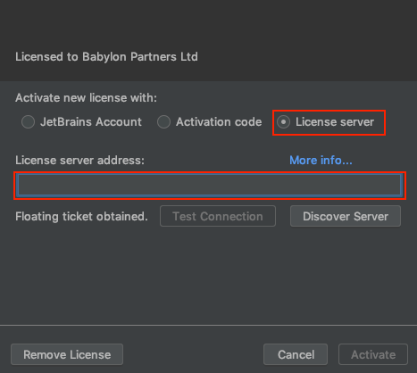
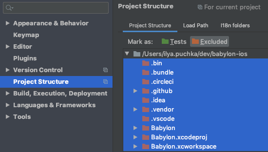

# RubyMine

If you have to work with Ruby, i.e. to update our fastlane setup, you better use an IDE that comes with some quality of life tools other than syntax higlighting.
We are extensively using JetBrains products in the company so our license includes such Ruby IDE as RubyMine.

To install it go to https://www.jetbrains.com/ruby/download/#section=mac to download the macOS app.
When asked about license enter the address of our license service. The service address is in 1Password. This service is only available from office network or via VPN.

Then open the root folder of our project. As most of the files are not in Ruby IDE will spend a lot of time tring to index files we don't need.
To avoid that go to **Preferences -> Project Structure** and select all the foldres except `fastlane` folder as **excluded**.

This will allow RubyMine to discover Ruby Gems that we have defined in the Gemfile in the root directory and only index fastlane files.

Now RubyMine will give you a hand with code complition for standard Ruby functions, will understand imports of gems with `require`, will suggest you fixes on syntax errors 
and other common errors like missing parameters and lint your code style (if you enable scanning with RuboCop).

NOTE: still couldn't find a way for it to understand imports of Fastlane types, i.e. `include FastlaneCore`, and to provide code completion on other fastlane internal types.
