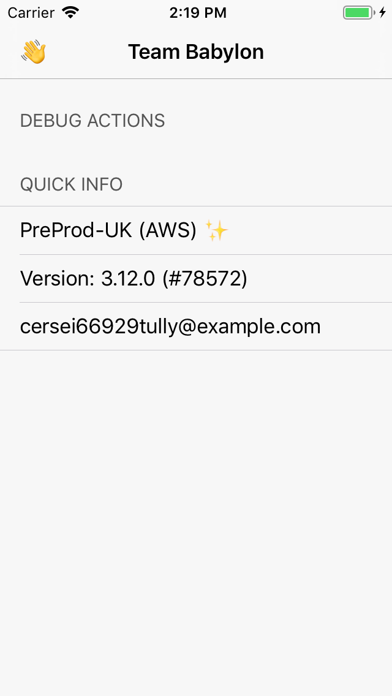

Integrate with the Debug Window
==========================================

Sometimes there is a complicated user journey, requiring multiple steps or data entry to proceed. Sometimes there is a prerequisite to reach a certain user flow that is awfully long for recurring manual QA and dev testing.

You want to have an early way out to this prolonged, endured pain of having to repeat yourselves just to get through them.

## 😘 The Debug Window is here to help! 🎉

## What is the Debug Window?

It always stands by and wait for you call — either

* Swipe in from the right screen edge; or
* Shake on any screen when there is no first responder (e.g. focused text field); or
* Press Command + D if you are running the app in the Simulator.



The Debug Window serves these functionalities:

* Provide a list of contextual debug actions.
* Quick access to useful debug information, like the current environment and the app version.

## What are debug actions?

Represented in code as `DebugAction`, these are debug shortcuts or side effects that are supported by your screen.

All `DebugAction` has a title, which need not be localized. You may configure them to be either of these three forms:

* Simple action — a simple one-off closure invocation;
* Producer action — starting a `SignalProducer`, and showing an alert upon failure; and
* Modal action — a factory closure which generates a `UIViewController`, which would be presented by the Debug Window.

### Ubiquitous actions

Sometimes there are debug actions that are valuable at any stage of a user journey. But you do not need to implement them over and over again for all the screens!

`DebugAction` can be marked as _ubiquitous_ when instantiated. The Debug Window, when it is about to appear, searches through the view controller hierarchy starting from the root view controller of the key window.

It collects **all** ubiquitous actions along the way towards the topmost view controller, and concatenates them with all the debug actions of the topmost view controller as the final list of actions.

#### Example

Given this scenario:
```
Screen A: [ Action a0, Action a1 (ubiquitous) ]
Screen B: [ Action b0, Action b1 ]
Screen C: [ Action c0 (ubiquitous) ]
Screen D: [ Action d0 ]

Key Window
    - [rootViewController] Navigation Flow
      Screen A -> Screen B -> Screen C
        - [presentedViewController] Screen D
```

When the Debug Window is activated on Screen D, you should have debug actions in the following sequence:

* Action d0
* Action c0
* Action a1

### 🚧 Shake quick action
If you expect your screen would ever have only one debug action, you can mark the `DebugAction` as _preferred for shake_.

Then when a user shakes with the screen on, the preferred debug action is triggered automatically, instead of the Debug Window being activated.

Do note that the shake ignores ubiquitous debug actions, and the activation gesture would continue to activate the Debug Window regardless of the presence of a preferred-for-shake action.

## How can my screen integrate with the Debug Window?
For Bento screens using `BabylonBoxViewController`, and Forms screens using `FormViewController` (🚧), simply conform your view model to `DebugActionsProviding`.

```swift
#if DEBUG
extension HomeViewModel: DebugActionsProviding {
    public var debugActions: [DebugAction] {
        return [
            DebugAction(
                title: "Best action",
                action: .producer(
                    .failed(AlertError(body: "is to do nothing.")), 
                    shouldDismiss: false
                )
            )
        ]
    }
}
#endif
```

For other screens with a custom view controller, conform your view controller to `DebugActionsProviding`, and forward the call to your view model if necessary.

### Do I need to worry about memory leak?
The Debug Window accesses `DebugActionsProviding.debugActions` only when it is activated. It releases all debug actions when it is dismissed. So you should not need to worry about memory leak.

If you do spot leaks due to the Debug Window, please file a ticket.

## What is Quick Info?

Just a bunch of relevant information about the current build and the user session for us devs and QA. Feel free to add more stuff as needed.

🚧 You may press the Share button to quickly share a textual version of the Quick Info to somewhere, e.g. Slack.