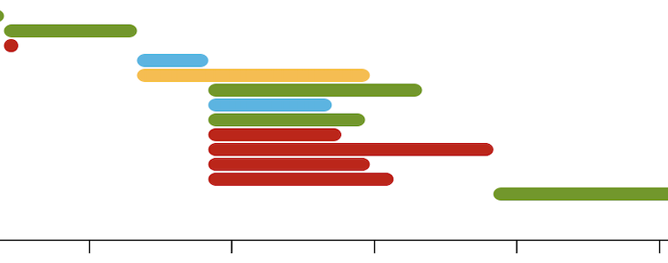
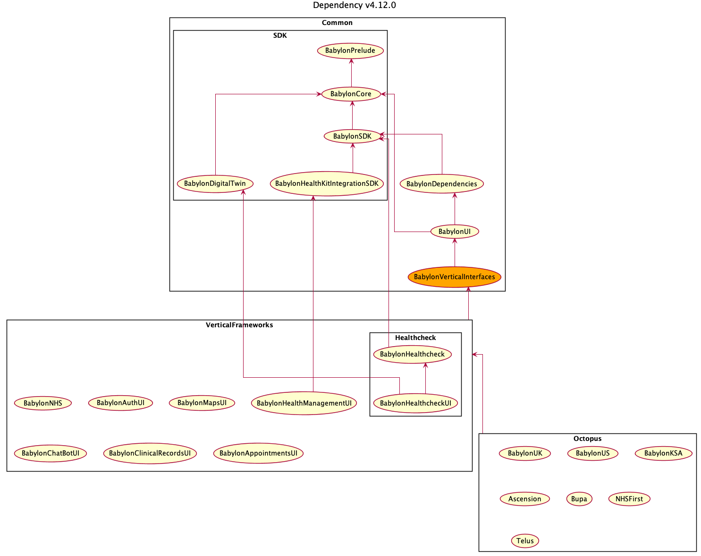

Vertical Frameworks
===================

## Overview

After modularisation refactoring in [IOSP-338](https://babylonpartners.atlassian.net/browse/IOSP-338), our Babylon App's UI screen framework dependencies are now fully decoupled from each other so called **Vertical Frameworks**.
It ensures that there are **no dependencies between each vertical** so that faster parallel build and easy maintainance become possible.

<br>
(Example of parallel build in Vertical Frameworks)<br>


In order to share each vertical's functionalities among other verticals, e.g. `ClinicalRecordsUI` using `MapsUI` feature, rather than one depending on the other sequentially, we now add **`BabylonVerticalInterfaces.framework`** ([PR-9964](https://github.com/babylonhealth/babylon-ios/pull/9964)) as a shim to **share each vertical's interfaces only** to the other verticals.



This documentation explains:

1. What goes into `BabylonVerticalInterfaces`
2. What are the rules for each Vertical Framework?

## 1. What goes into `BabylonVerticalInterfaces`?

Just like C's header file, `BabylonVerticalInterfaces` must only contain interfaces that describes the **syntax of the API** without exposing its implementation (semantics).

Following code are considered as shareable interfaces:

1. `protocol`s (without default implementation)
2. `struct`s and `enum`s that protocol-method uses (DTOs)

### `protocol`s (without default implementation)

`protocol`s are normally used as an existential abstraction over some concrete types (especially behavioural classes).
It allows to inject concrete dependencies via constructor injection or [global `Current` access](Current-guide.md) that is not known at callee's (e.g. vertical) compile time but later determined at caller's (e.g. Octopus) compile time or runtime.

Since adding implementation is prohibited in this interface framework in general, adding protocol default implementation is also discouraged.
However, if it is simple and valid enough to be worth sharing across every vertical (e.g. making alias of other protocol method, empty IO, …), we may add such default implementation.

### `struct`s and `enum`s that those protocols use (DTOs)

While using `protocol` is a canonical way of abstracting concrete types into a syntactic level, applying to `struct` or `enum` data types (or DTOs, data-transfer-objects) is often tedious and sometimes doesn't work nicely (e.g. protocol method consuming those data types can't be abstracted as existential due to a contravariance issue).

Instead, we will just migrate `struct` and `enum` data types directly to `BabylonVerticalInterfaces`, with **only containinig minimal structure i.e. constructors and accessors**, since they should all be simple DTOs.

For example, following code only contains minimal constructors and accessors, thus it is allowed to be added in `BabylonVerticalInterfaces`.

```swift
// Struct DTO example
public struct MapConfiguration {
    // Struct member accessors
    public let isSearchEnabled: Bool
    public let selectionPolicy: MapReturnSelectionPolicy

    // Struct constructors
    public init(
        isSearchEnabled: Bool = true,
        selectionPolicy: MapReturnSelectionPolicy
    ) {
        self.isSearchEnabled = isSearchEnabled
        self.selectionPolicy = selectionPolicy
    }

    // NOTE: Helper constructor is OK to add, if it is **logically valid**.
    public init(
        isSearchEnabled: Bool = true,
        showDetailSelectable: Bool = false
    ) {
        self.isSearchEnabled = isSearchEnabled
        self.selectionPolicy = .showDetails(selectable: showDetailSelectable)
    }

    // Enum DTO example
    public enum MapReturnSelectionPolicy {
        // Enum constructors
        case userAsksForDirections
        case showDetails(selectable: Bool)

        // Enum optional accessors (enum-properties)
        var isUserAsksForDirections: Bool { ... }
        var showDetails: Bool? { ... }
    }
}
```

On the other hand, extended methods outside of `struct`/`enum`'s definitions are prohibited.

```swift
extension MapConfiguration {
    // ❌ Do not extend any additional methods other than `constructors` and `accessors`,
    //    even though it may seem to be useful to all verticals.
    public func debugMe() {
        print(/* prints `self` in fancy way */)
    }
}
```

## 2. What are the rules for each Vertical Framework?

1. Each vertical framework can **only link to the common frameworks (from `BabylonPrelude` up to `BablyonVerticalInterfaces`)**, and should never link to other vertical frameworks.
2. Each vertical can add `extension World` (local `World`).

    ```swift
    // e.g. in MapsUI
    extension World {
        // NOTE: `private static var` is used as a replacement of local `var Current = ...`
        private static var maps: MapsUI!

        // Namespaced local world accessor via `Current.maps`.
        public var maps: MapsUI { Self.maps }

        // Setup Local World
        public func configureMaps(
            config: MapsUI.Configuration
        ) {
            World.maps = MapsUI(config: config)
        }

        // Local World data structure.
        public struct MapsUI { ... }
    }
    ```

    - See Also: [Current-guide.md](Current-guide.md), [FeatureSwitchesRedesign.md](https://github.com/babylonhealth/ios-playbook/blob/master/Cookbook/Proposals/FeatureSwitchesRedesign.md)
3. Feature switch, localisation, etc, needs to be handled correctly (see each guideline below).
    - [FeatureSwitchesRedesign.md](https://github.com/babylonhealth/ios-playbook/blob/master/Cookbook/Proposals/FeatureSwitchesRedesign.md)
    - Localisation: TBD


## References

- [[IOSP-338] Refactor BabylonAppointmentsUI to not link with any vertical - Babylon Jira](https://babylonpartners.atlassian.net/browse/IOSP-338)
    - Previous work of decoupling from MapsUI up to AppointmentsUI
- [[IOSP-456] Add BabylonVerticalInterfaces.framework](https://github.com/babylonhealth/babylon-ios/pull/9964)
