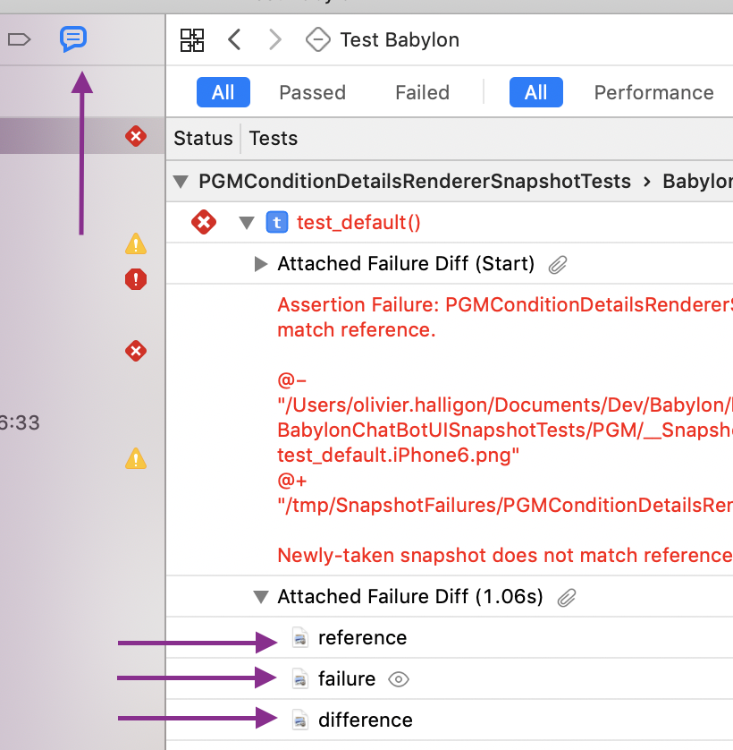

# Xcode tips and tricks

## Keybindings
As we spend so much time in our ~~favourite~~ editor, it's essential to learn keybindings to decrease content switching and maintain focus.

#### Navigating and finding things
As long as the project is indexed, Xcode lets you jump to anything from anywhere.

- **Cmd-Shift-0** to open the Apple documentation window.
- **Cmd-Ctrl-[** or **]** to cycle between targets.

##### Find symbols, files or text
- **Cmd-Shift-O** and type anything to quickly jump to files or symbols. **Enter** to open, **Opt-Enter** to open in the assistant editor.
- **Cmd-Ctrl-J** (as in “jump”) or **Cmd-Ctrl-Click** on a symbol to go to definition. Add **Opt** to open in assistant editor.
- Right click and “Find Selected Symbol in Workspace” to show in the search pane where the symbol under cursor is used.
- **Cmd-Shift-F** to search in workspace (the whole project). You'll want to select Text on top because searching for references is tricky manually, they require specific syntax.
- **Cmd-Opt-J** and type to filter files by name in the Project Navigator (or tests in the Test Navigator). Useful if you want to find multiple files with the same name, or can't quite remember how a file is called.

##### File level navigation
- **Cmd-Shift-J** to show the open file in the Project Navigator.
- **Cmd-Ctrl-Left** or **Right** in a file to navigate between recently open files.
- **Ctrl-6** in a file to open the list of methods and variables. You can then type to apply a filter and hit Enter to jump to the selected completion.
- **Cmd-Opt-Shift-Left** in a file to fold all methods and **Cmd-Opt-Shift-Right** to unfold. May be useful to get a quick overview.

#### Making space for your code
Use these keybindings to give your code more space, and show the panes again quickly when needed. You can keep the panes nice and wide this way, and just hide them when you're not using them, rather than keep them thin and see them all the time.

- **Cmd-Shift-Y** to show or hide the bottom drawer (locals and console output).
- **Cmd-0** and **Cmd-Opt-0** to fold and unfold the left and right panes, respectively.
- **Cmd-Enter** to close the assistant editor and leave only the main editor pane.

#### Working with the assistant editor
If your screen is big enough or your font is small enough to allow using two editors side by side, this is a very efficient way to work.

- **Cmd-Enter** to close the assistant editor and leave only the main editor pane.
- **Ctrl-`** to switch between the main editor and the assistant editor.

In general, you can add **Opt** to any command that opens or navigates to a file to open it in the assistant editor instead. Here are a few to get you started:

- **Cmd-Ctrl-Opt-J** or **Cmd-Ctrl-Opt-Click** to open the definition for symbol under cursor in the assistant editor.
- **Opt-Click** in workspace search (**Cmd-Shift-F**).
- **Opt-Enter** in Open Quickly (**Cmd-Shift-O**).

## Testing
Everyone knows you hit **Cmd-U** to start testing… right?

It's annoying when your tests fail, but even more annoying to try and compare the failed snapshots in */tmp/SnapshotFailures/*. Thankfully, Xcode can help you out.

After you've run the tests, in the Test Navigator (**Cmd-9**) open the latest test report, switch to Failed tests and you'll find XCTAttachments for before, after and diff attached to the failed test:



## Errors when pulling code/switching branches
Various errors can occur when pulling code/switching branches. 
Typically all that is needed is running `bundle exec pod install` and closing
and reopening the project in Xcode. The following directions are
intended to be a more thorough reset to deal with bigger changes.

- Clean Build: Product > Clean (shortcut: Cmd-Shift-K)
- Close Xcode
- Update bundle: run `bundle install`
- Clean install pods: run `rm -rf Pods/ && bundle exec pod install --repo-update`
- Clean DerivedData: can be found at
`~/Library/Developer/Xcode/DerivedData` and/or `babylon-ios/DerivedData`
- Reopen project in Xcode (or run `xed .` from the project directory)

## Project file conflicts
When merging develop into your branch, if the project file has been changed in both locations, there may be a conflict. This file can be very difficult to merge manually. You can use the mergepbx tool to handle these conflicts easier.

- The repo can be found here: [link](https://github.com/simonwagner/mergepbx)
- You can install with brew: `brew install mergepbx`
- After it is installed, you can add these lines to your `~/.gitconfig`:
```
#driver for merging Xcode project files
[mergetool "mergepbx"]
	cmd = mergepbx "$BASE" "$LOCAL" "$REMOTE" -o "$MERGED"
```
- Then whenever you run into a project file conflict you can resolve it with:
`git mergetool --tool=mergepbx [Project File]`
e.g: `git mergetool --tool=mergepbx Babylon.xcodeproj/project.pbxproj`

## Console logs
- To disable autolayout warnings add `-_UIConstraintBasedLayoutLogUnsatisfiable NO` to the scheme launch arguments
- To disable other system activity logs add `OS_ACTIVITY_MODE` environment variable with `disable` value
