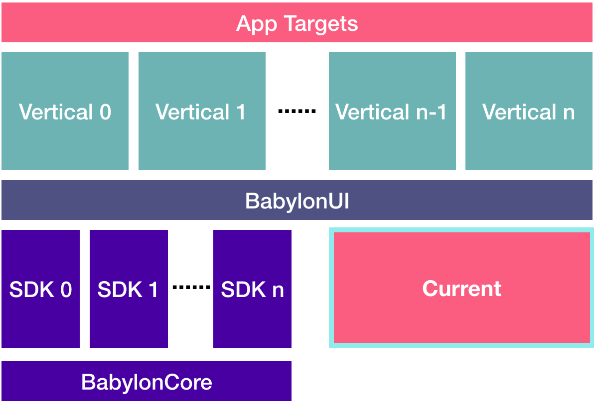

How to Control the World
========================

## Introduction

This proposal is heavily based on episodes [16](https://www.pointfree.co/episodes/ep16-dependency-injection-made-easy) and [18](https://www.pointfree.co/episodes/ep18-dependency-injection-made-comfortable) of [Pointfree](https://www.pointfree.co) and Stephen Celis's talk [How to Control the World](https://vimeo.com/291588126) at NSSpain 2018. Slides of that talk are [also available](https://speakerdeck.com/stephencelis/how-to-control-the-world).

## Motivation

To overcome some of the disadvantages of dependency injection:

* Adding a new dependency down the chain can mean passing that dependency all the way down through many layers. Many of those layers only need to get passed the dependency in order to pass it down to the next layer. This leads to a lot of source files being changed just to add a single dependency.

* Many of our dependencies, such as the Analytics or the AB Testing Service are, in reality, singletons which never change at runtime and are just passed all over the place.

* In order to gain the testing benefit of dependency injection (e.g: being able to substitute a dependency with a stub implementation for testing), you have to use Protocols, which add unnecessary boilerplate.

## Benefits

* Avoid having to pass singleton dependencies down through multiple layers of injection.

* Ability to easily create different app "environments" to simulate running on different dates, timezones and locales, for example.

* Ability to have "mock" environments for testing. For example, testing that analytics events are correctly being sent is typically quite difficult. With a mock analytics service in a mock app environment this becomes trivial, and without the need to inject an analytics service protocol to every part of the app.

## Implementation

Define a `struct` to provide dependencies of the environment external to the app (the "World" in which the app lives), and static configuration dependencies:

```swift
struct World {
    var date = { Date() }
    var calendar = Calendar.autoupdatingCurrent
    var timezone = Timezone.autoupdatingCurrent
    var locale = Locale.autoupdatingCurrent
    var analytics = Analytics()
}
```

We can make external services like `Analytics` mockable without needing protocols:

```swift
struct Analytics {
    struct Event {
        var name: String
        var properties: [String: String]
    }

    var track = track(_:)
}

private func track(_ event: Analytics.Event) {
    // track
}

extension Analytics {
    static let mock = Analytics(track: { event in
        print("Mock track", event)
    })
}
```

By pulling the implementation (the `track` function) out into a private free function, it can be substituted with a mock.

## Creating the World

Now all we need is to instantiate an instance of `World` called `Current` which is our current environment. By default this will instantiate the production dependencies:

```swift
var Current = World()
```

## Usage

Everywhere where we'd be using a dependency, use `Current` to access it instead. For example, use `Current.date()` as opposed to `Date()`.

## Testing & Simulating different environments

If we want to setup a test environment we create the `World` with test values instead of the defaults:

```swift
var Current = World(
    date: { Date(timeIntervalSinceReferenceDate: 557152051) },
    calendar: Calendar(identifer: .gregorian),
    timezone: Timezone(identifier: "Europe/London")!,
    locale: Locale(identifier: "en_GB"),
    analytics: .mock
)
```

## Applying this to the Babylon iOS project

The project uses protocols and dependency injection **heavily**. `Struct`-based approaches like the `Analytics` example above are probably not a realistic target for a first implementation of `Current` in our project.

Instead I propose that, for now, we put everything that is currently in `AppDependencies` into `Current`, along with `date`, `calendar`, `timezone` and `locale` (which we currently are not even injecting).

For context, our `AppDependencies` struct currently looks like this:

```swift
struct AppDependencies {
    let environment: Environment
    let networkDependencies: NetworkDependencies
    let visualDependencies: VisualDependenciesProtocol
    let appConfiguration: AppConfigurationProtocol
    let analyticsService: AnalyticsTrackingService
    let abTestingService: ABTestingServiceProtocol
    let biometricAuth: BiometricAuthProtocol
    let notificationsAuth: UserNotificationsAuthorizationProtocol
    let settings: Settings

    // initaliser omitted
}
```

This will already save us a lot of DI boilerplate and give us the ability to simulate different date, calendar, timezone and locale settings easily.

Once we get more familiar with using `Current`, we can explore using the `struct` approach above for the analytics and AB testing services.

## Where is the boundary between Current and using Dependency Injection?

In previous discussions with the team it was agreed that we can / should use `Current` only as far as the level of our Builders and no further. The Builders should still continue to inject any dependencies required by View Models, View Controllers and Flow Controllers, such that these entities have no need to know anything about `Current`.


## Where will Current live?

In order for `Current` to be accessible from all of the Babylon frameworks, we should create a new framework 🙈 , maybe named `BabylonWorld`, which can be imported into all our frameworks that require it.

<p align="center">

</p>

The definition should be something like:

```swift
public var Current = World()
```

In order for this to work, we will need default values for some of the `AppDependencies` to store in `Current` as this would normally be configured shortly after app startup (currently in `SharedAppDelegate`).
